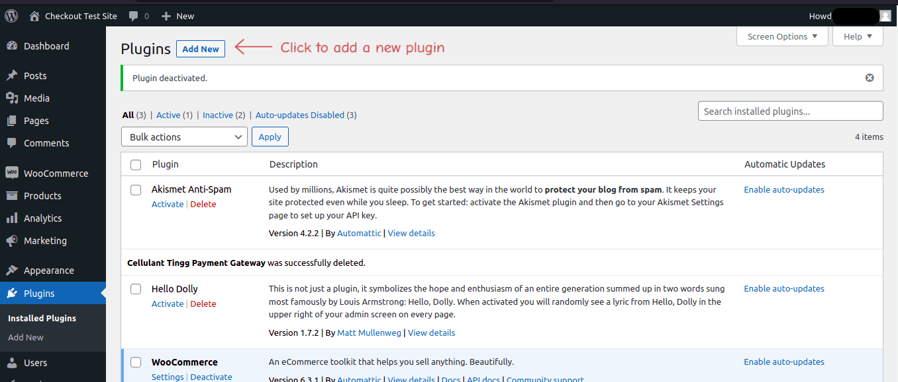
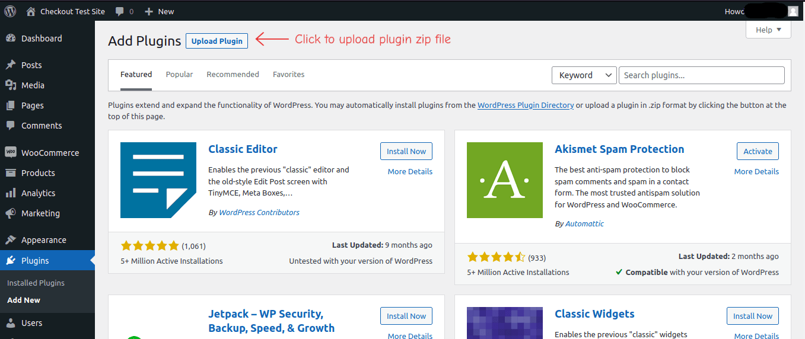
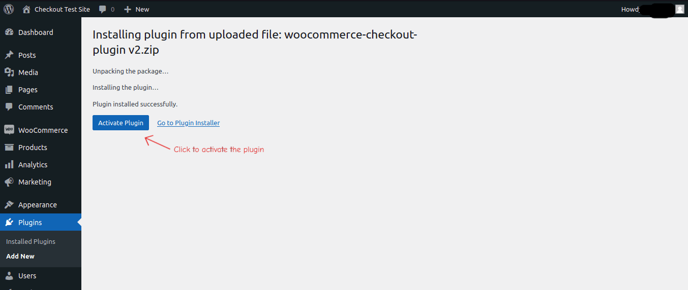
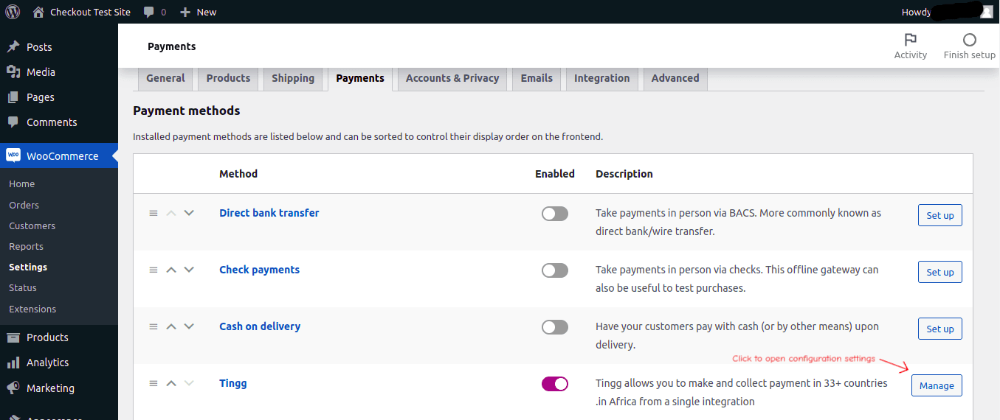
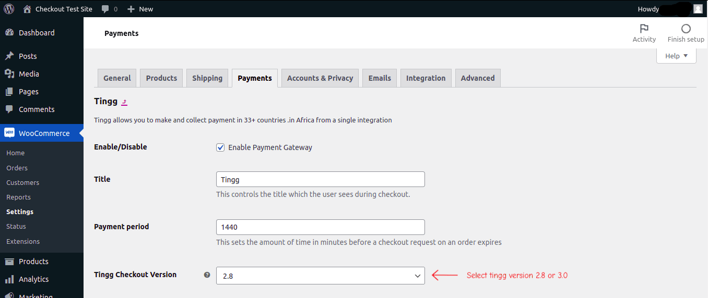
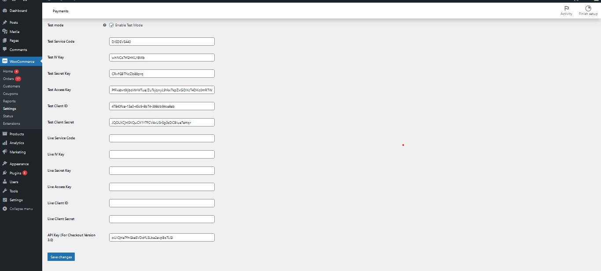

# Cellulant Tingg Woocommerce Payment Gateway Plugin

## Description

A WooCommerce payment gateway for merchants to integrate Tingg express checkout on their Woocommerce checkout page,
offering their customers a pan-african variety of payment options.

## Installation

---
Installation on the WordPress plugin store

### Steps

1. Download the latest plugin zip file.
2. Login into your WordPress site admin dashboard and add a new plugin
   
3. Upload the zip file
   
4. Activate the plugin.
   
5. Click __manage__ to open plugin settings.
   
6. Select the tingg checkout version you would like to integrate. Check out our documentation for 
   [2.8](https://cellulant.gitbook.io/checkout/) and 
   [3.0](https://dev-portal.tingg.africa/get-started) to
   learn more about the version and the differences.
   
7. Enable test mode to use test keys from the developer sandbox and save changes.
   
8. __Go Live:__ Disable test mode and add your production keys on the live keys section to start collecting payments online.

## Frequently Asked Questions

1. Does Tingg checkout collect outside Africa?

- TLDR; No.
- Currently we are only enable payments in African markets.

## Credentials details

You will need to register on the developer sandbox 
for checkout version [__2.8__](https://developer.tingg.africa/checkout/v2/portal/#/register/user) or [__3.0__](https://app.uat.tingg.africa/onboarding/create-account) to get the credentials to be used for the
integration. The credentials are the ``service code (business code)``, ``access key``, ``iv key`` and ``secret key``.

## Contributors

* Cellulant

## Tags

- [x] tingg
- [x] africa
- [x] payments,
- [x] cellulant
- [x] integration,
- [x] woocommerce

## Requirements

- Requires at least: `4.6`
- Tested up to woocommerce version: `6.3.1`
- Stable tag: `4.3`
- Requires PHP: `5.2.4`
- License: `GPLv2` or later
- License URI: https://www.gnu.org/licenses/gpl-2.0.html

## Changelog

* `1.0.0`
* Initial release
